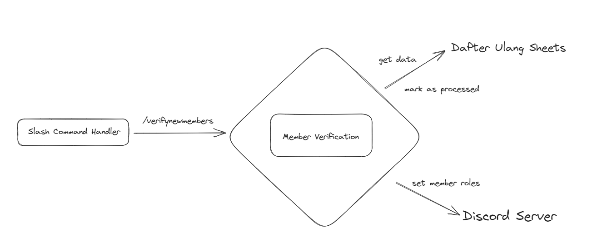

# VCPA

`DVA` is a Discord bot that reads google sheets data to verify members on the discord server and assign roles according to their region & Binusian angkatan.

## Quick Start

1. Create an application at the [discord developer portal](https://discord.com/developers/applications)
2. Clone the repository
3. Create a .env file (see example.env) at the repository root
4. Install dependencies with (`npm install`)
5. Build (`npm run build`) and run (`npm start`)

## Contribution Guide

-   This project uses the [Prettier](https://prettier.io/) code formatter. Please make sure code is formatted submitting for pull request.

## Dependencies

### Major Dependencies

-   [discord.js](https://discord.js.org/) | The Discord client library of choice. Used for both bot gateway and REST API access.
-   [googleapis](https://www.npmjs.com/package/googleapis) | For connecting to Google Sheets.

### Minor Dependencies

-   [zod](https://zod.dev/) | For parsing expected shapes from Sheets.
-   [immutable-js](https://immutable-js.com/) | For fast immutable data structures.

## Architecture

This project roughly goes by [Hexagonal Architecture](<https://en.wikipedia.org/wiki/Hexagonal_architecture_(software)>). In a nutshell, we distinguish between the Driving Side (left side), Core App (middle) and Driven Side (right side).

Discord's [Slash Commands](https://support.discord.com/hc/en-us/articles/1500000368501-Slash-Commands-FAQ) are the driving side of this app.

All business logic is contained in "lib". It accesses data from Sheets and makes changes to the Discord server through adapters (the Driven side).

To keep file counts low, implementations are located in the same file as the interfaces, unless there are multiple implementations.

